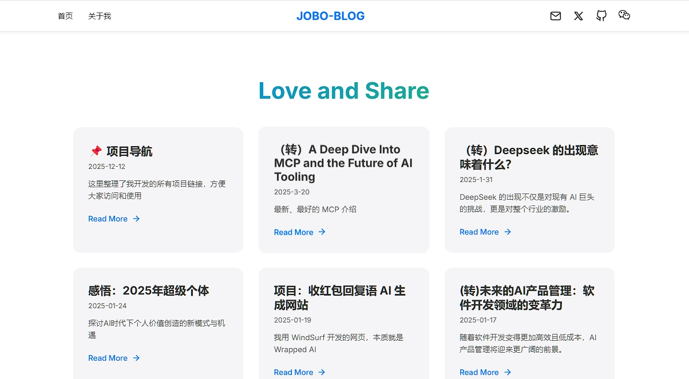

# 个人博客项目

这是一个基于 Astro 4.x 构建的现代化个人博客网站，采用苹果风格设计，注重用户体验和性能优化。


## 🌐 预览


---


## ✨ 特性

- 🎨 简约的苹果风格设计
- 📱 响应式布局，完美适配各种设备
- 🖼️ 自定义背景图片与透明度
- ⚡️ 快速加载（静态生成）
- 📝 完整的 Markdown 支持
- 🌐 自动生成站点地图

## 🛠️ 技术栈

- **框架**: Astro 4.x
- **UI组件**: Astro Components

## 🚀 快速开始

### 环境要求
- Node.js >= 18.14.1
- npm 或 yarn

### 本地开发
```bash
# 克隆项目
git clone 

# 进入项目目录
cd blog

# 安装依赖
npm install

# 启动开发服务器
npm run dev
```
访问 http://localhost:3000 查看网站

### 生产部署
```bash
# 构建网站
npm run build

# 预览构建结果
npm run preview
```
访问 http://localhost:4321 预览

## 📁 项目结构
```
project/
├── src/
│   ├── components/    # 可复用组件
│   ├── content/       # Markdown 文章
│   ├── layouts/       # 页面布局模板
│   ├── pages/         # 路由页面
│   └── lib/          # 工具函数和数据库操作
├── public/           # 静态资源
└── astro.config.mjs  # Astro 配置
```

## 📝 写作指南

### 创建新文章
1. 在 `src/content/blog` 目录下创建 `.md` 文件
2. 添加以下 frontmatter 信息：
```markdown
---
title: '文章标题'
date: '2024-02-07'
summary: '文章摘要'
image: '/blog-images/your-image.png'  # 可选
tags: ['标签1', '标签2']  # 可选
---
```

### Markdown 特性
- ✅ GitHub Flavored Markdown
- ✅ 代码块语法高亮
- ✅ 表格支持
- ✅ 任务列表
- ✅ 图片优化和懒加载
- ✅ 数学公式支持

## 🚀 部署说明

### 腾讯云部署
1. 在腾讯云 Web 应用托管创建应用
2. 配置构建参数：
   ```
   构建命令：npm run build
   安装命令：npm install
   产物目录：dist
   ```
3. 配置环境变量（如需要）
4. 开启自动部署

## 🔧 性能优化

- 图片资源优化：
  - 使用 WebP 格式
  - 自动生成响应式图片
  - 懒加载处理
- 资源压缩：已启用 JS/CSS 压缩
- 静态生成：所有页面预渲染
- 代码分割：自动的 JS/CSS 代码分割
- 缓存策略：合理的缓存配置

## 🤝 贡献指南

1. Fork 项目
2. 创建特性分支
3. 提交改动
4. 推送到分支
5. 提交 Pull Request

## 📄 许可证

MIT